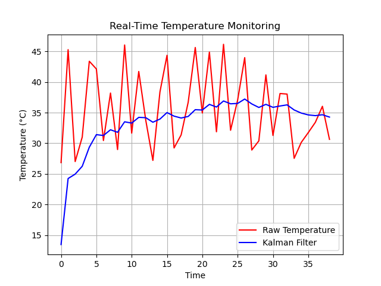

# Real-time Sensor Data Monitoring System

## Overview
This project implements a real-time sensor data monitoring system using C++. It includes multiple processes for sensor simulation, data processing, logging, and visualization. The system applies **anomaly detection using a Kalman filter** and provides **real-time plotting of sensor data**.

## Features
- **Multithreading & Multiprocessing**: Separate processes for sensor simulation, data processing, and logging.
- **Networking**: Uses TCP for sensor data transmission.
- **Ring Buffer**: Efficient in-memory storage for sensor readings.
- **Anomaly Detection**: Implements a **Kalman filter** to detect unusual sensor readings.
- **Real-time Plotting**: Graphs live sensor data.
- **Modular Design**: Easy to expand with additional sensor types or processing methods.

## Architecture
### Components
1. **Sensor Simulator** (Process)
   - Simulates temperature sensor readings.
   - Sends data over a TCP connection (Boost asio).

2. **Data Processing** (Process)
   - Receives and processes incoming sensor data.
   - Stores values in a **ring buffer**.
   - Uses a **Kalman filter** to smooth data and detect anomalies.

3. **Logger** (Process)
   - Makes use of Boost MessageQueue to publish logs
   - Logs sensor readings and anomalies.
   - Alerts when abnormal values are detected.

4. **Real-time Plotter**
   - Displays live sensor data using **Matplotlib-cpp**.

   - Example:
   


## Installation
### Prerequisites
- **C++17 or later**
- **CMake**
- **Boost.Asio** (for networking)
- **Matplotlib-cpp** (for visualization)

### Building the Project
```sh
mkdir build && cd build
cmake ..
make
```

## Running the System
1. Start the **Monitoring System**:
   ```sh
   ./monitoringSystem
   ```
2. Start the **Sensor Client**:
   ```sh
   ./sensorClient
   ```
3. Start the **Logger**:
   ```sh
   ./loggerServer
   ```
4. Set the **Log Level**:
   ```sh
   ./setLogLevel
   ```

## Starting Scripts
Some shell scripts have been created for easy starting/stopping of the full system.
1. Start all processes
   ```sh
   ./startAll.sh
   ```
2. Stop all processes
   ```sh
   ./stopAll.sh
   ```
